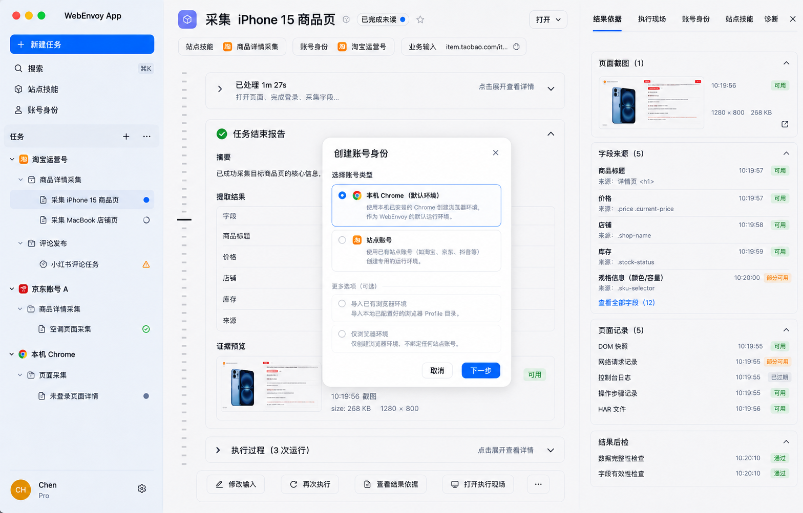

# 0008. Desktop UI 设计 checkpoint

## 状态

Accepted for FR #92 checkpoint，2026-07-02。

本 ADR 覆盖 #92 以及 Work Item #96、#97、#98、#99。它是 #93、#94、#95 进入实现前必须消费的 docs-only 设计事实载体，不实现 Electron shell、React UI、API client、schema、fixture、viewer、evidence store 或组件系统。

## 背景

本 checkpoint 初稿曾按 Work/Library/Browser/Settings 划分产品域。后续产品讨论明确：App 的首个桌面产品不应被理解成 Agent App、普通 Browser tab、任意任务启动器或技术人员控制台；同时也不能把 Library 和 Browser 管理台降级成不可见后台。

App 面向人类业务用户。App 的自动任务执行入口只运行 Lode 封装的确定性站点 workflow，通过 Harbor 账号身份和浏览器环境运行，通过 Core 记录 task/run/result/evidence/failure。Agent 使用 WebEnvoy 的方式是 API、CLI、MCP、SDK 或 skills，不在 App 内运行；这些非 App 调用方产生的运行事实仍应能在 App 中观测。

## 决策

采用 Task Thread first 桌面方向。

```text
Task = 站点技能 + 账号身份 + 业务输入
Run = 同一 Task 下的一次执行记录
```

该 Task 语义主要约束 App 自动 workflow 任务。外部 Agent/API/CLI/MCP/skills 产生的运行事实也要能在 App 中展示，但不要求它们都来自 App 的自动执行入口。

左侧任务列表默认按 `账号身份 -> 站点技能 -> Task` 组织。中间栏展示当前 Task Thread、Run navigation rail、任务结束报告和执行过程。右侧是可折叠上下文面板，用 tab 承载结果依据、执行现场、账号身份、站点技能和诊断。

没有合适站点技能时，App 不能自动执行任务，但可以作为账号身份和浏览器环境的启动台，让用户手动打开受控浏览器实例、登录、观察或准备环境。手动浏览实例属于 Browser/Harbor session 管理路径，不创建 Core Task/Run，不产生 Result Envelope，也不代表 Lode capability 被执行。只有用户显式从站点技能发起自动任务时，App 才向 Core 提交 task intent。

Task Thread first 是主体验，不取消后台能力工作台：Library 仍管理站点技能、能力包、版本、失效、fixture、更新和草稿；Browser 仍管理账号身份、浏览器环境、Runtime Session、Viewer、接管和 provider facts。

这不是高保真原型，也不是最终数据结构。它只冻结 #93/#94/#95 不应偏离的产品方向。

## Selected visual draft

当前选定方向稿：



可吸收：

- macOS-like desktop window、稳定左侧栏、中间 Task Thread、右侧上下文面板；
- 左侧 `任务` 区按账号身份和站点技能组织 Task；
- 中间栏 Codex-like navigation rail 表达同一 Task 下的 Run/过程定位；
- 任务完成后默认展开任务结束报告，执行过程可折叠；
- 底部固定任务操作区承载 `修改输入`、`再次执行`、`查看结果依据`、`打开执行现场`；
- 右侧 tab 面板承载结果依据、执行现场、账号身份、站点技能和诊断。

不可照抄：

- 图中具体字段、时间、状态枚举、卡片内容和 icon 不是合同；
- 图不是像素级规范；
- 图不证明 schema、API、runtime、evidence policy 或真实 workflow 已完成；
- 图中的视觉细节不得覆盖 Core、Harbor、Lode 的 owner contract。

## 产品定义

| 概念 | 定义 | App 边界 |
| --- | --- | --- |
| 站点技能 | Lode 封装的确定性 workflow。 | App 自动执行入口必须选择站点技能；App 只展示和选择，不定义 package/schema truth。 |
| 账号身份 | 账号状态和浏览器环境组合；可包含登录账号，也可只是本机 Chrome/default environment。 | App 只管理入口和展示 owner facts，不保存 credential/cookie/profile storage。 |
| 业务输入 | 用户为 workflow 提供的 URL、素材、字段或操作参数。 | App 负责表单体验和提交意图，不定义 Core task schema。 |
| Task | `站点技能 + 账号身份 + 业务输入` 形成的任务线程。 | App 用它组织体验；durable truth 由 Core/Lode/Harbor 合同决定。 |
| Run | 同一 Task 下的一次执行尝试。 | App 展示 Core run facts，不自建生命周期。 |
| 结果依据 | 证明结果来源的 evidence refs、字段来源、页面记录、post-check 和 owner facts。 | App 不保存 raw evidence。 |
| 执行现场 | Harbor 提供的 Runtime Session、Viewer、takeover 和 browser environment facts。 | App 不绕过 Harbor API 操作浏览器。 |
| 外部运行事实 | Agent、API、CLI、MCP、SDK、skills 或其他上层应用产生的 task/run/result/evidence/session facts。 | App 可观测和呈现，不要求外部调用方遵循 App 自动任务入口。 |
| 手动浏览实例 | 用户通过账号身份启动的受控浏览器实例。 | 可用于登录、观察、接管和准备环境；不是自动任务执行结果。 |

## 信息架构

### 左侧栏

```text
窗口/应用头部
全局入口
  新建任务
  搜索
  站点技能
  账号身份
任务
  淘宝运营号
    商品详情采集
      采集 iPhone 15 商品页
      采集 MacBook 店铺页
    评论发布
      小红书评论任务
  京东账号 A
    商品详情采集
      空调页面采集
  本机 Chrome
    页面采集
      未登录页面详情
底部用户/设置区
```

规则：

- 全局入口的 `账号身份` 是管理页，用于增删改查；
- `任务` 区标题右侧 hover 时显示 `+` 和 `⋯`；
- `+` 是快速创建任务，流程从选择账号身份开始；
- `⋯` 是排序、分组、筛选和需要处理等列表操作；
- 状态只作为 Task 行右侧小图标或动态标记，不作为第一分组。

### 中间栏

中间栏是当前 Task Thread。

- 顶部：任务标题、完成/未读状态、站点技能、账号身份、业务输入；
- 右上：`打开 ▾` 控制上下文面板；
- 正文左侧：Codex-like navigation rail；
- 正文：任务结束报告、可折叠执行过程、run/action/result records；
- 底部：固定任务操作区，不是自由输入聊天框。

底部固定操作区首批包含：

- 修改输入；
- 再次执行；
- 查看结果依据；
- 打开执行现场；
- 更多操作。

运行中可显示轻量状态，例如 `正在执行中...`、`停止`、`打开现场`。不要把底部做成 Agent composer。

### 右侧上下文面板

右侧是可折叠上下文面板，不是第二个主工作区。

首批 tab：

- 结果依据；
- 执行现场；
- 账号身份；
- 站点技能；
- 诊断。

`打开 ▾` 控制位于中间栏 tab 面板顶部右上角；右侧面板只展示当前 tab 内容。没有 tab 打开时，可以展示可打开面板列表或空态。

### Library 和 Browser 管理面

Task Thread first 不取消管理面。

- Library 管理站点技能、能力包、版本、失效、fixture、更新、草稿、导入和后续 Explorer 入口。
- Browser 管理账号身份、浏览器环境、Runtime Session、Viewer、接管、provider facts 和手动浏览启动。
- 这些管理面可以从全局入口、上下文面板或深层页面进入，但不抢占自动任务执行的首屏心智。

## Task / Run 规则

| 变化 | 处理 |
| --- | --- |
| 站点技能变化 | 新 Task。 |
| 账号身份变化 | 新 Task。 |
| 主要业务输入变化 | 新 Task。 |
| 重试同一输入 | 同一 Task 下新 Run。 |
| 登录后继续 | 同一 Task 下新 Run。 |
| 接管后继续 | 同一 Task 下新 Run。 |
| Runtime session 重启 | 同一 Task 下新 Run。 |
| post-check / validation 重跑 | 同一 Task 下新 Run。 |

这条规则是当前产品判断，不是最终 Core schema。后续如 Core 合同不同，必须回到 #92/#93/#94 重新确认 App 表达。

## 状态与输出类型

App 不展示 Agent 消息流，但可以吸收 Codex App 对过程输出的层级处理：

| 类型 | UI 规则 |
| --- | --- |
| 进行中说明 | 短文本，放在执行过程，可折叠。 |
| 工具/动作调用 | 结构化活动记录，默认折叠或摘要。 |
| 工具/动作结果 | 输出、错误、耗时、引用，长内容截断。 |
| 任务结束报告 | 任务完成后的主输出，默认展开。 |
| 富展示 | evidence link、图片、字段来源、页面记录、现场入口，按 owner policy 渲染。 |

运行中默认展开当前过程；完成后默认收起过程，展开任务结束报告。

## Desktop shell 边界

Electron 是 App carrier，不是 WebEnvoy runtime。

| Layer | 可以拥有 | 不能拥有 |
| --- | --- | --- |
| Electron main/native layer | Window lifecycle、menus、file dialogs、notifications、OS theme、keychain boundary、profile path locator display、app quit/restart、安全 local config file access。 | task/run/result/evidence/capability/recovery protocols、Core Run Record truth、Harbor session/profile/browser storage truth、Lode package truth、raw evidence、CDP/VNC endpoints。 |
| Renderer/App UI | Navigation、local UI state、owner API clients、display projections、source health display、带 source/fetched_at/stale marker 的非敏感 cache。 | Durable task store、alternate status machine、raw artifact storage、local package registry、credential/cookie/token storage。 |
| Owner APIs | Core task/run/result/failure/action facts；Harbor account identity/session/viewer/runtime facts；Lode site skill/package/catalog facts。 | App-local UI preferences 和 transient loading state。 |

## 后续实现入口条件

| Future FR | 可开始条件 | 禁止事项 |
| --- | --- | --- |
| #93 Electron + React shell | 消费本 ADR 和 `DESIGN.md`，建立 shell、sidebar、task thread frame、right context panel 和 bottom control area。 | 不实现真实 task/run contract，不把 domain protocol 放进 Electron main。 |
| #94 read-only task/run view | Core/Lode/Harbor 最小合同字段足以提交确定性只读 workflow，并能展示 run/result/failure。 | 不定义 App-owned task schema、run lifecycle、result envelope 或 retry semantics。 |
| #95 evidence/capability/Browser references | Evidence 默认可见性、Browser state 强度和 right context tabs 有明确 owner facts。 | 不保存 raw evidence，不暴露 raw CDP/VNC endpoint，不把 Harbor health 当 task outcome。 |

## 覆盖 issue

| Issue | 覆盖 |
| --- | --- |
| #92 | 冻结 Desktop Task Thread 设计 checkpoint，并记录后续实现消费边界。 |
| #96 | 定义左侧任务组织、中间 Task Thread、右侧上下文面板和默认路径。 |
| #97 | 定义 task、run、result evidence、site skill、account identity 和 context state 的 UI 关系。 |
| #98 | 定义 loading、process、completion report、failure、unavailable、redacted、expired、unknown outcome 的显示原则。 |
| #99 | 复核 Electron/native layer 仅拥有 OS 能力，禁止业务 protocol truth 进入 shell。 |

## 非目标

- 不做高保真原型。
- 不冻结最终数据结构。
- 不初始化 Electron/Vite/React/TypeScript。
- 不安装依赖或创建 package manifest。
- 不创建 UI component library。
- 不修改 Core、Harbor 或 Lode。
- 不保存 raw evidence、credential、cookie、browser profile storage、package body 或 Run Record。
- 不关闭或实现 #93、#94、#95。

## 后果

- 后续 App 实现不会继续沿用 Agent App、Browser Tab 或任意任务启动器方向。
- `站点技能 + 账号身份 + 业务输入 = Task` 成为当前 checkpoint 的产品语义。
- App 自动执行入口被收窄到 Lode 确定性 workflow，但 App 仍是 WebEnvoy 全局观测和管理入口。
- 设计稿进入版本控制，作为方向参考，而不是像素规范。
- 仍需后续 issue 消费真实 Core/Harbor/Lode 合同来校正字段、状态和数据结构。
